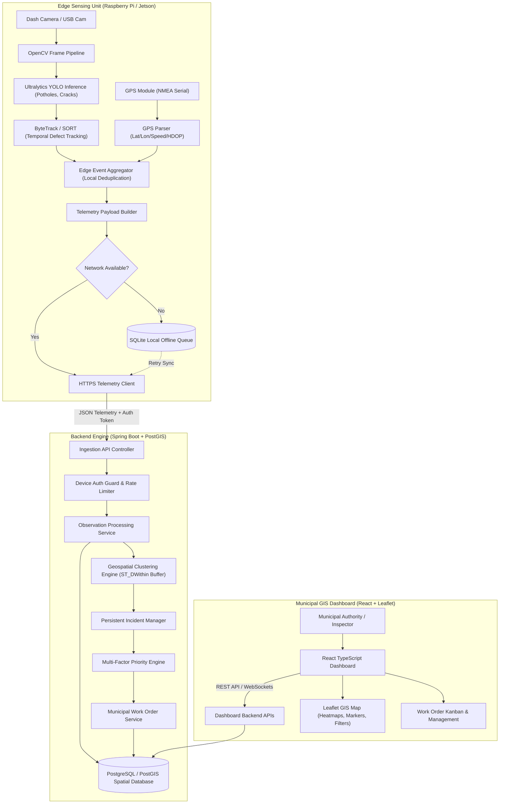

# System Architecture: SIH26124 Mobile Urban Intelligence Platform

## 1. Executive Summary & Vision

**SIH26124** converts municipal public transport buses into mobile, AI-powered infrastructure sensing units. As buses traverse urban routes daily, edge compute devices attached to dash-cameras and GPS receivers run real-time Computer Vision models to detect road defects (potholes, cracks, missing markings) and municipal issues. 

Rather than sending continuous video streams (which consumes massive bandwidth and raises privacy concerns), edge devices run local temporal object tracking, aggregate multi-frame detections of a single physical defect into localized event telemetry, and transmit light spatial-temporal payloads to a centralized Spring Boot + PostGIS backend. The backend applies geospatial clustering (DBSCAN / ST_DWithin buffer matching) to aggregate observations from multiple buses into verified, persistent Incidents. A multi-factor Priority Engine computes severity scores, rendering actionable work orders on an interactive React + Leaflet GIS Dashboard for municipal authorities.

---

## 2. High-Level Architecture Diagram



---

## 3. Subsystem Breakdown

### 3.1 Edge AI & Vision Pipeline (`edge/ai`)
- **Camera Capture**: High-throughput frame capture using OpenCV (`cv2.VideoCapture`).
- **Inference Engine**: Lightweight Ultralytics YOLO (YOLOv8n/YOLOv11n) quantized with ONNX Runtime or NPU acceleration (OpenVINO / TensorRT / Hailo).
- **Temporal Tracking (ByteTrack/SORT)**: Tracks bounding boxes across frame sequences. Assigns a unique `track_id` to each defect detected while the bus moves towards and past it.
- **Local Event Aggregation**: Once a `track_id` disappears from frame view (or exceeds max lifetime), the edge aggregator calculates:
  - Highest confidence detection frame.
  - Max bounding box surface area ratio (proxy for defect size / distance).
  - Exact GPS position recorded during maximum bounding box size.
  - Emits a single `ObservationEvent` payload rather than 30+ raw detections per second.

### 3.2 GPS & Edge Telemetry Client (`edge/telemetry`)
- **NMEA GPS Parser**: Connects to `/dev/ttyUSB0` or `/dev/ttyAMA0` serial port at 9600/115200 baud. Parses `$GPRMC` and `$GPGGA` sentences for Latitude, Longitude, Altitude, Speed, HDOP, and UTC Timestamp.
- **Offline Storage Queue**: Built using Python `sqlite3` or `Queue`. When network connectivity drops:
  - Events are saved into an encrypted SQLite database table `buffered_events`.
  - Queue worker polls network status with exponential backoff (1s, 2s, 4s... up to 60s max).
  - Flushes buffered events chronologically when backend connectivity is restored.

### 3.3 Central Backend Ingestion (`backend/ingestion`)
- **Spring Boot 3.x REST Service**: Exposes secure `/api/v1/telemetry/observations` endpoint.
- **Device Authentication**: Uses pre-shared device tokens or HMAC signatures generated with device private key (`X-Device-Signature`).
- **Idempotency**: Prevents duplicate event ingestion using `device_id` + `event_uuid` combination.

### 3.4 Multi-Bus Spatial Clustering & Incident Verification (`backend/spatial`)
- **Problem**: Multiple buses (or the same bus on different trips) will report the same physical pothole with slight GPS errors (3 to 10 meters variance).
- **Solution**:
  - `ST_DWithin(obs_location, incident_location, distance_meters)` is used for spatial candidate matching.
  - Spatial radius threshold \( R_{spatial} = 10.0 \text{ meters} \).
  - If a matching un-closed `Incident` exists within 10 meters of the same defect class:
    - Attach observation to existing `Incident`.
    - Recalculate Incident centroid location (weighted average by observation confidence and GPS accuracy).
    - Increment `observation_count` and update `last_observed_at`.
  - If no matching Incident is found, create a new `Incident` record with state `UNVERIFIED`.
  - When `observation_count >= VERIFICATION_THRESHOLD` (e.g. 2 independent bus passes), update status to `VERIFIED`.

### 3.5 Multi-Factor Priority Engine (`backend/priority`)
The priority score \( P \in [0, 100] \) determines incident urgency:

$$P = \min\left(100, \alpha \cdot W_{class} + \beta \cdot C_{avg} + \gamma \cdot S_{est} + \delta \cdot \log_2(N_{obs} + 1) + \epsilon \cdot T_{persistence}\right)$$

Where:
- \( W_{class} \): Base severity weight for defect category (e.g., Deep Pothole = 30, Road Crack = 15, Missing Zebra Crossing = 25).
- \( C_{avg} \): Average confidence score of observations (\( 0.0 - 1.0 \)).
- \( S_{est} \): Estimated physical size score derived from bounding box ratios.
- \( N_{obs} \): Number of independent bus observations.
- \( T_{persistence} \): Time duration defect has persisted without resolution (days).
- \( \alpha, \beta, \gamma, \delta, \epsilon \): Calibrated weighting coefficients.

**Severity Categorization**:
- **CRITICAL**: \( P \ge 75 \) (Immediate dispatch required)
- **MODERATE**: \( 45 \le P < 75 \) (Scheduled repair queue)
- **LOW**: \( P < 45 \) (Routine maintenance monitoring)

### 3.6 GIS Dashboard & Municipal Portal (`frontend`)
- Interactive Leaflet / OpenStreetMap visualizer with cluster markers (`react-leaflet-cluster`).
- Severity color coding: Red (CRITICAL), Amber (MODERATE), Green/Blue (LOW / RESOLVED).
- Filtering by date range, defect class, severity level, municipal ward, and work order status.
- Work Order dispatch interface: Assign municipal contractors, upload completion photos, audit resolution timeline.

---

## 4. Database Schema & Data Models

```sql
-- PostgreSQL + PostGIS Schema

CREATE EXTENSION IF NOT EXISTS postgis;

-- 1. Bus Devices Table
CREATE TABLE bus_devices (
    device_id VARCHAR(64) PRIMARY KEY,
    bus_number VARCHAR(32) NOT NULL,
    route_id VARCHAR(32),
    status VARCHAR(16) DEFAULT 'ACTIVE',
    last_heartbeat TIMESTAMP WITH TIME ZONE,
    created_at TIMESTAMP WITH TIME ZONE DEFAULT CURRENT_TIMESTAMP
);

-- 2. Persistent Incidents Table (Merged Multi-Bus View)
CREATE TABLE incidents (
    incident_id UUID PRIMARY KEY DEFAULT gen_random_uuid(),
    defect_type VARCHAR(32) NOT NULL, -- 'POTHOLE', 'ROAD_CRACK', 'MISSING_MARKING', etc.
    status VARCHAR(24) DEFAULT 'UNVERIFIED', -- UNVERIFIED, VERIFIED, IN_PROGRESS, RESOLVED, REJECTED
    severity_level VARCHAR(16) DEFAULT 'LOW', -- LOW, MODERATE, CRITICAL
    priority_score DOUBLE PRECISION DEFAULT 0.0,
    centroid GEOMETRY(Point, 4326) NOT NULL,
    observation_count INT DEFAULT 1,
    first_observed_at TIMESTAMP WITH TIME ZONE NOT NULL,
    last_observed_at TIMESTAMP WITH TIME ZONE NOT NULL,
    assigned_ward VARCHAR(64),
    created_at TIMESTAMP WITH TIME ZONE DEFAULT CURRENT_TIMESTAMP,
    updated_at TIMESTAMP WITH TIME ZONE DEFAULT CURRENT_TIMESTAMP
);

CREATE INDEX idx_incidents_centroid ON incidents USING GIST (centroid);
CREATE INDEX idx_incidents_status ON incidents (status);
CREATE INDEX idx_incidents_severity ON incidents (severity_level);

-- 3. Telemetry Observations Table (Individual Edge Detections)
CREATE TABLE observations (
    observation_id UUID PRIMARY KEY DEFAULT gen_random_uuid(),
    incident_id UUID REFERENCES incidents(incident_id) ON DELETE SET NULL,
    device_id VARCHAR(64) REFERENCES bus_devices(device_id),
    defect_type VARCHAR(32) NOT NULL,
    confidence DOUBLE PRECISION NOT NULL,
    estimated_size_sqm DOUBLE PRECISION,
    location GEOMETRY(Point, 4326) NOT NULL,
    speed_kmh DOUBLE PRECISION,
    heading_deg DOUBLE PRECISION,
    image_crop_url VARCHAR(255), -- Privacy-sanitized cropped patch of defect only
    observed_at TIMESTAMP WITH TIME ZONE NOT NULL,
    created_at TIMESTAMP WITH TIME ZONE DEFAULT CURRENT_TIMESTAMP
);

CREATE INDEX idx_observations_location ON observations USING GIST (location);
CREATE INDEX idx_observations_incident ON observations (incident_id);

-- 4. Municipal Work Orders
CREATE TABLE work_orders (
    work_order_id UUID PRIMARY KEY DEFAULT gen_random_uuid(),
    incident_id UUID UNIQUE REFERENCES incidents(incident_id),
    assigned_contractor VARCHAR(128),
    status VARCHAR(24) DEFAULT 'ASSIGNED', -- ASSIGNED, IN_PROGRESS, COMPLETED, INSPECTED
    target_completion_date DATE,
    resolution_notes TEXT,
    resolved_at TIMESTAMP WITH TIME ZONE,
    created_at TIMESTAMP WITH TIME ZONE DEFAULT CURRENT_TIMESTAMP
);
```

---

## 5. Privacy & Security Architecture

### Privacy Safeguards
1. **No Raw Video Transmission**: Raw camera video feeds remain on the edge device memory ring-buffer and are overwritten every 60 seconds. Raw video is never stored persistently or transmitted to backend servers.
2. **Selective Patch Cropping**: Only tightly cropped bounding box patches of the road surface (e.g. pothole patch) may be saved for auditing.
3. **Automated De-identification**: An automated edge pre-processor blurs license plates and pedestrian faces using lightweight face/plate detection before sending audit thumbnails.

### Security Controls
1. **Device Authentication**: Edge devices utilize TLS mutual authentication (mTLS) or signed JWT headers (`X-Device-Token`) generated via hardware TPM / secure storage.
2. **Backend API Security**: Spring Security with OAuth2 / JWT stateless token authentication for web portal users. Role-Based Access Control (RBAC): `ROLE_ADMIN`, `ROLE_MUNICIPAL_INSPECTOR`, `ROLE_TRANSIT_OPERATOR`.
3. **Secret Management**: Environment variables (`.env`) used for database credentials, JWT secrets, and API keys. Zero hardcoded secrets in repository.

---

## 6. Edge Hardware & Software Specification

| Subsystem | Component / Specs |
| :--- | :--- |
| **Edge Processor** | Raspberry Pi 4 B (4GB/8GB) / Raspberry Pi 5 / NVIDIA Jetson Orin Nano |
| **Camera Module** | Wide-angle USB Dashcam (1080p @ 30fps) / Raspberry Pi Camera Module 3 |
| **GPS Receiver** | u-blox NEO-6M / NEO-M8N GPS Module with Active Antenna (UART/Serial) |
| **Power Supply** | 12V-to-5V Buck Converter connected to Bus Auxiliary Power |
| **Storage** | 64GB High-Endurance MicroSD (for OS & local SQLite offline queue) |
| **Connectivity** | 4G/LTE USB Dongle / Cellular Hat (SIM7600G-H) |

---

## 7. Strategic Architectural Principles

1. **Edge-Driven Deduplication**: Avoid frame-by-frame spam by aggregating track lines at the edge.
2. **Probabilistic Spatial Matching**: Accept GPS inaccuracies by performing bounding-box / buffer matching rather than rigid coordinate comparison.
3. **Resilient Offline First Design**: Store telemetry locally on bus hardware during cellular dead-zones; auto-sync when back online.
4. **Extensible AI Taxonomy**: Modular model definition allowing rapid fine-tuning from `pothole` to multi-class infrastructure defects (`road_crack`, `missing_marking`, `traffic_congestion`, `damaged_signage`).